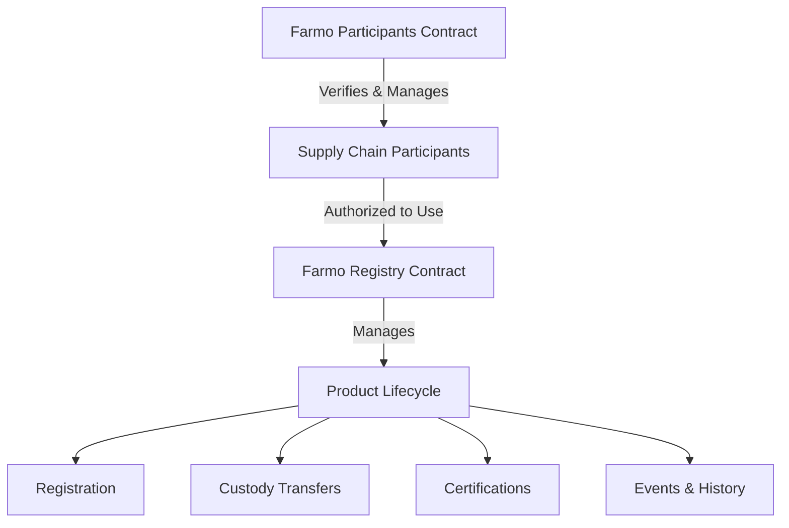

# Farmo Agricultural Supply Chain

A blockchain-based platform providing end-to-end transparency and traceability for agricultural supply chains on the Stacks blockchain.

## Overview

Farmo enables all participants in the agricultural supply chain to verify and track products from farm to consumer. The platform allows:

- Farmers to register their produce with detailed information
- Supply chain participants to record product handling and transfers
- Certification authorities to verify product qualities and standards
- Consumers to access complete product history and verify authenticity

## Architecture

The platform consists of two main smart contracts that work together to manage the agricultural supply chain:



### Farmo Participants Contract
- Manages participant registration and verification
- Handles role-based access control
- Maintains reputation scores
- Controls admin and verifier permissions

### Farmo Registry Contract
- Manages product registration and tracking
- Records custody transfers
- Handles certifications
- Maintains comprehensive event history

## Contract Documentation

### Farmo Participants Contract

Core functionality for managing supply chain participants:

#### Key Functions:
- `register-participant`: Self-registration for new participants
- `verify-participant`: Verifier approval of participants
- `update-participant-status`: Manage participant status
- `update-reputation-score`: Adjust participant reputation

#### Roles:
- Farmers
- Distributors
- Processors
- Retailers
- Verifiers
- Admins

### Farmo Registry Contract

Handles all product-related operations:

#### Key Functions:
- `register-product`: Create new product entries
- `transfer-custody`: Transfer product ownership
- `add-certification`: Add product certifications
- `record-supply-chain-event`: Log supply chain events

#### Features:
- Unique product identification
- Custody tracking
- Certification management
- Event history

## Getting Started

### Prerequisites
- Clarinet
- Stacks wallet
- Node.js

### Installation

1. Clone the repository
```bash
git clone <repository-url>
cd farmo
```

2. Install dependencies
```bash
npm install
```

3. Run local Clarinet chain
```bash
clarinet integrate
```

## Function Reference

### Participant Management

```clarity
(register-participant 
    (name (string-utf8 100))
    (role uint)
    (location (string-utf8 100))
    (metadata (string-utf8 256)))
```

### Product Management

```clarity
(register-product 
    (product-type (string-ascii 50)) 
    (harvest-date uint))
```

```clarity
(transfer-custody 
    (product-id uint) 
    (new-custodian principal) 
    (details (string-utf8 200)) 
    (location (optional (string-ascii 100))))
```

## Development

### Testing

Run the test suite:
```bash
clarinet test
```

### Local Development

1. Deploy contracts:
```bash
clarinet deploy
```

2. Initialize admin:
```clarity
(contract-call? .farmo-participants initialize-first-admin)
```

## Security Considerations

### Access Control
- Role-based permissions enforce proper authorization
- Only verified participants can perform operations
- Admin functions are restricted to authorized administrators

### Data Integrity
- Immutable history of all supply chain events
- Verified certifications from authorized authorities
- Timestamped custody transfers

### Limitations
- Certification authority verification is centralized
- Product data privacy is public on-chain
- Processing costs scale with supply chain complexity